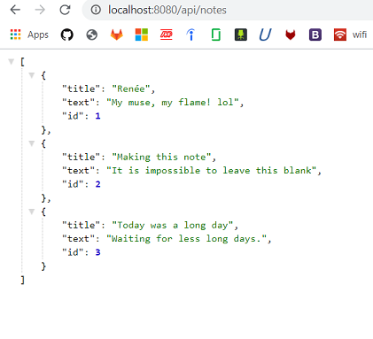

# Notebook

This application, "Notebook", write, save, and delete notes. It uses an express backend and save and retrieve note data from a JSON file called `db.json`.

## Usage
Download dependencies:
```
$ npm install
```

Startup Server:
```
$ node server.js
```

## Routes
* HTML routes:

  * GET `/notes` - Returns the `notes.html` file.

  * GET `*` - Returns the `index.html` file

* API routes:

  * GET `/api/notes` - Reads the `db.json` file and return all saved notes as JSON.

  * POST `/api/notes` - Recieves a new note to save on the request body, adds it to the `db.json` file, and then returns the new note to the user.

  * DELETE `/api/notes/:id` - Recieves a query paramter containing the id of a note to delete, removes the note with the given `id` property, and then rewrites the notes to the `db.json` file.

## Preview
  

  
## API

  
## Credits
Johns Hopkins full-Stack Bootcamp

Stetson Lewis

Donald Hesler

## License

MIT License

Copyright (c) 2020 Phill Mitchell-Matsuyama

Permission is hereby granted, free of charge, to any person obtaining a copy
of this software and associated documentation files (the "Software"), to deal
in the Software without restriction, including without limitation the rights
to use, copy, modify, merge, publish, distribute, sublicense, and/or sell
copies of the Software, and to permit persons to whom the Software is
furnished to do so, subject to the following conditions:

The above copyright notice and this permission notice shall be included in all
copies or substantial portions of the Software.

THE SOFTWARE IS PROVIDED "AS IS", WITHOUT WARRANTY OF ANY KIND, EXPRESS OR
IMPLIED, INCLUDING BUT NOT LIMITED TO THE WARRANTIES OF MERCHANTABILITY,
FITNESS FOR A PARTICULAR PURPOSE AND NONINFRINGEMENT. IN NO EVENT SHALL THE
AUTHORS OR COPYRIGHT HOLDERS BE LIABLE FOR ANY CLAIM, DAMAGES OR OTHER
LIABILITY, WHETHER IN AN ACTION OF CONTRACT, TORT OR OTHERWISE, ARISING FROM,
OUT OF OR IN CONNECTION WITH THE SOFTWARE OR THE USE OR OTHER DEALINGS IN THE
SOFTWARE.
